# Solaris Pousada

> Este trabalho tem como objetivo a implementação de um sistema para gestão de uma pousada. O sistema será desenvolvido na linguagem de programação PHP, com utilização do framework Laravel. Identificado os principais pontos a serem otimizados, o estudo desenvolveu-se sob a necessidade de implementação do sistema que, através da web possibilitará a interação junto aos serviços administrativos pelos funcionários, e a utilização de serviços comerciais pelos clientes. Dentre as funcionalidades do sistema destacam-se o envio e recebimento de arquivos e processos internos, bem como o cadastro, reservas e alterações das informações.  

## 💻 Pré-requisitos

Antes de executar o projeto, verifique se você atendeu aos seguintes requisitos:

* Instalar à versão mais recente do [PHP](https://www.php.net/downloads.php), [Composer](https://getcomposer.org/download/), [MySQL](https://dev.mysql.com/downloads/installer/), [NodeJS](https://nodejs.org/en/download/).
* Ter uma máquina com SO `<Windows / Mac>`.

## 🚀 Iniciando o projeto

Configurando o php.ini:

```
Descomentar as extensions abaixo dentro do arquivo php.ini:

;extension=fileinfo   ->  extension=fileinfo
;extension=pdo_mysql  ->  extension=pdo_mysql
```

Configurando o projeto:

```
composer install
composer update
```

Configurando o .env

```
DB_DATABASE= (Nome do banco)
DB_PASSWORD= (Password)

```

Iniciando o projeto (verifique se está no diretório do projeto):
```
php artisan migrate --seed
php artisan serve
```

Login padrão de Admin:
```
LOGIN: admin@hotel.com
SENHA: admin123
```

## 🚀 Principais Funcionalidades

* SignIn Web
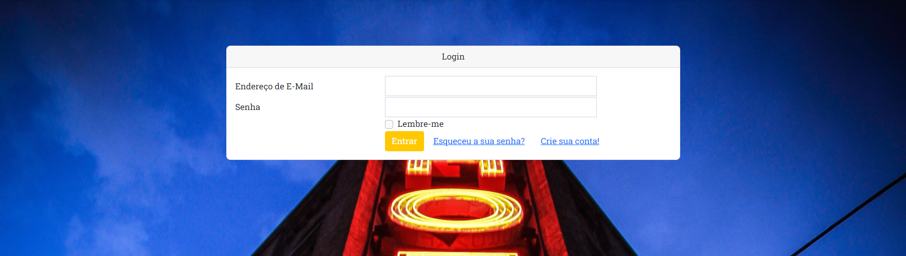

* SignUp Web
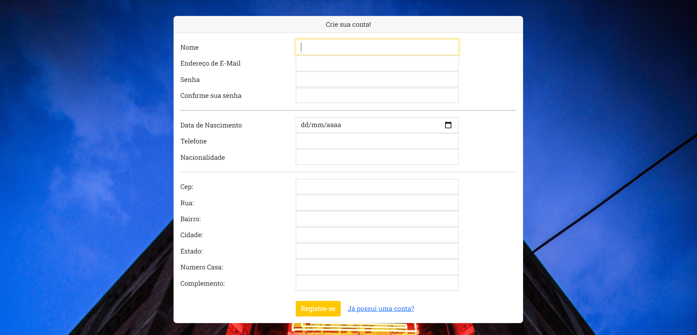

* Page Web
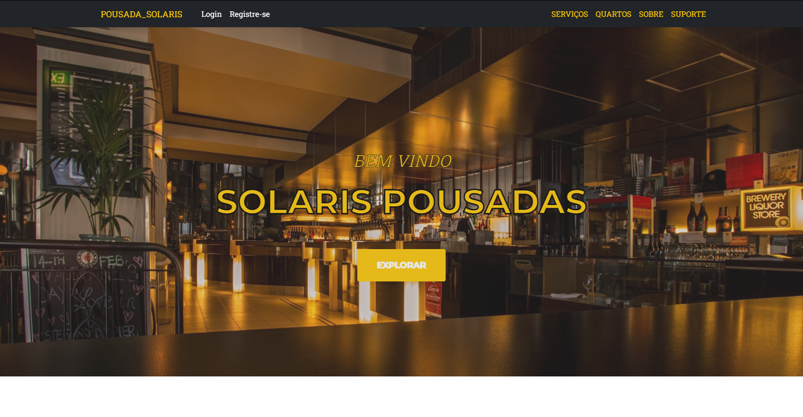
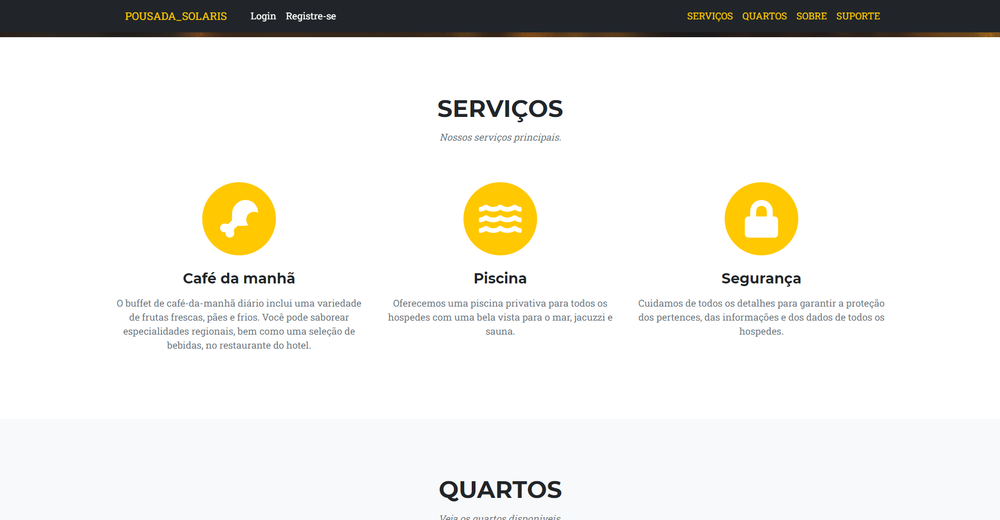
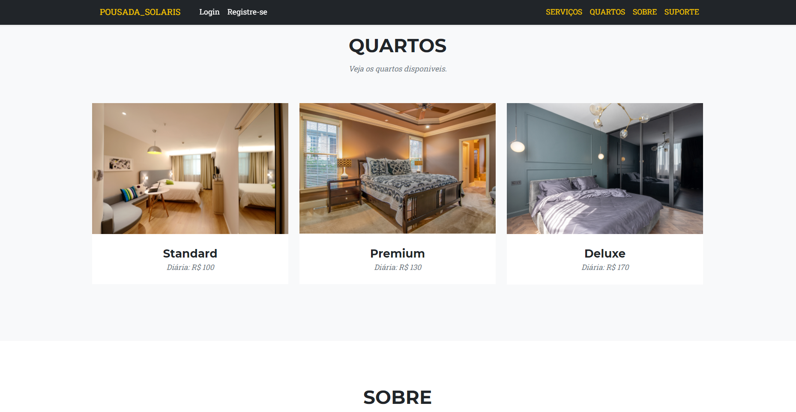
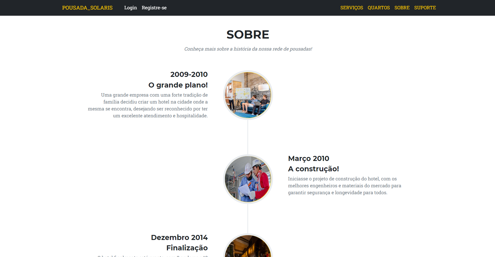
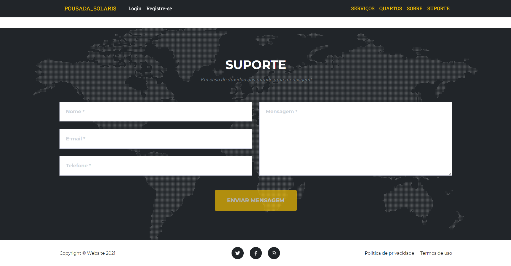

* Aluguel Hospede Web
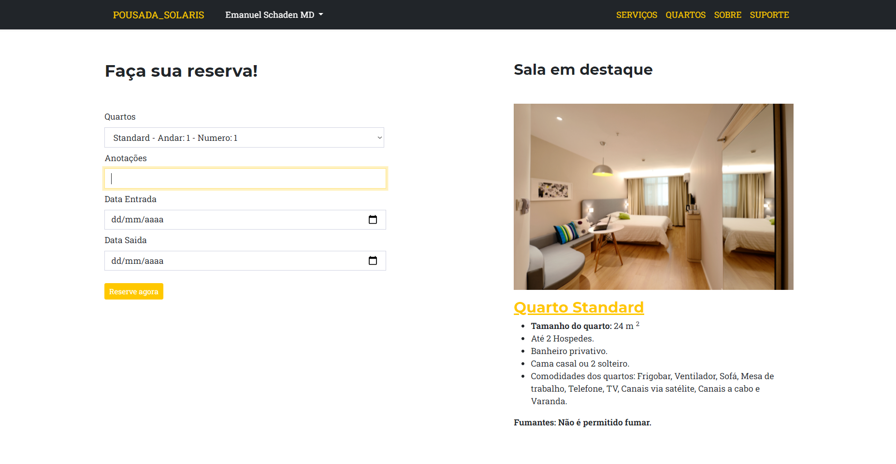

* Info Aluguel Hospede Web
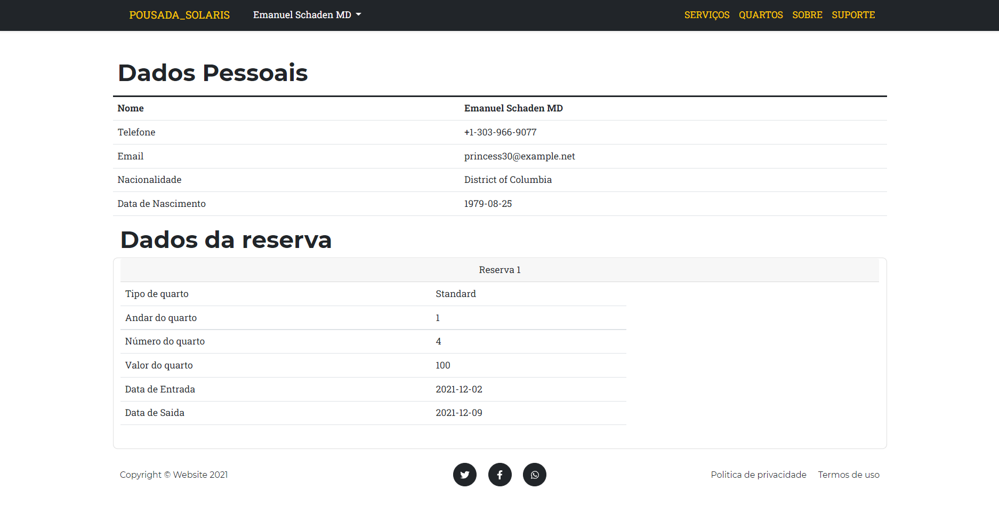

* SignIn Mobile
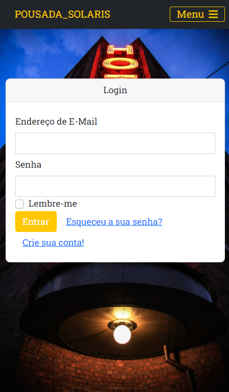

* SignUp Mobile
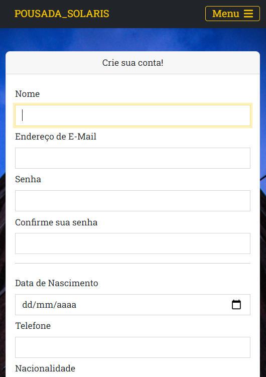

## 🤝 Colaboradores

Agradecemos às seguintes pessoas que contribuíram para este projeto:

<table>
  <tr>
    <td align="center">
      <a href="https://github.com/devinibonfim">
        Vinícius Bonfim
      </a>
    </td>
  </tr>
  <tr>
    <td align="center">
      <a href="https://github.com/Dev0Nakayama">
        João Nakayama
      </a>
    </td>
  </tr>
  <tr>
    <td align="center">
      <a href="https://github.com/desenvolvedormarinho">
        Maxmiliano Marinho
      </a>
    </td>
  </tr>
  <tr>
    <td align="center">
      <a href="https://github.com/Dev-GabrielN">
        Gabriel Souza
      </a>
    </td>
  </tr>
  <tr>
    <td align="center">
      <a href="https://github.com/mguilherm">
        Marcos Guilherme
      </a>
    </td>
  </tr>
</table>
